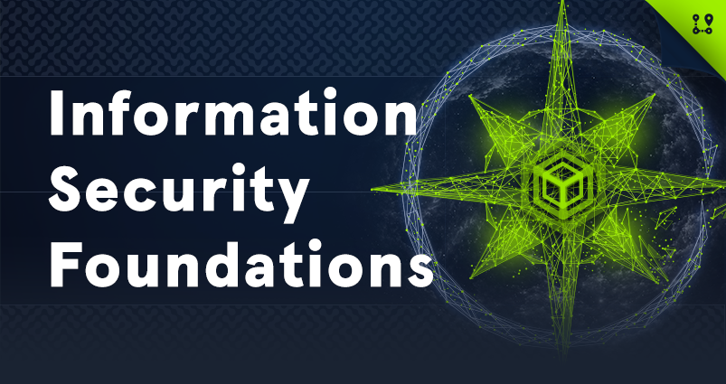

# Information Security Foundations

|  |
|---|
| Information Security is a field with many specialized and highly technical disciplines. Job roles like Penetration Tester & Information Security Analyst require a solid technical foundational understanding of core IT & Information Security topics. This skill path is made up of modules that will assist learners in developing &/or strengthening a foundational understanding before proceeding with learning the more complex security topics. Every long-standing building first needs a solid foundation. Welcome to Information Security Foundations. |
