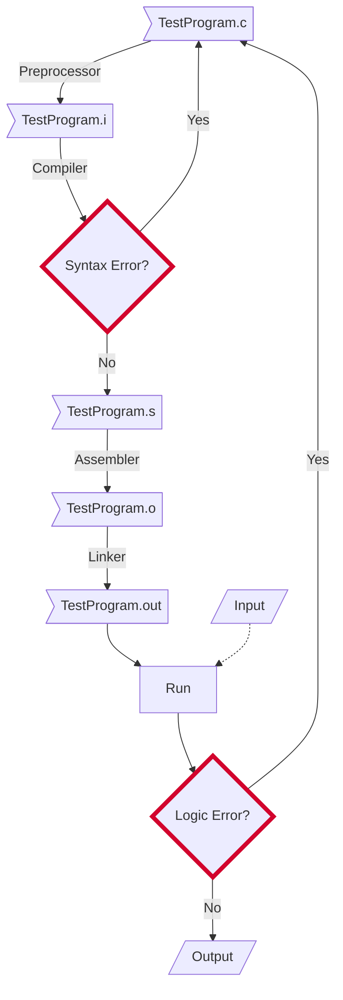

# Execution Process

```mermaid
flowchart TD
  classDef red stroke:#d2042d,stroke-width:5px;
  F0>TestProgram.c]
  F1>TestProgram.i]
  F2>TestProgram.s]
  E1{Syntax Error?}:::red
  F3>TestProgram.o]
  F4>TestProgram.out]
  R[Run]
  I[/Input/]
  E2{Logic Error?}:::red
  O[/Output/]
  F0-->|Preprocessor|F1-->|Compiler|E1
  E1-->|Yes|F0
  E1-->|No|F2-->|Assembler|F3-->|Linker|F4-->R-->E2
  I-.->R
  E2-->|Yes|F0
  E2-->|No|O
```
